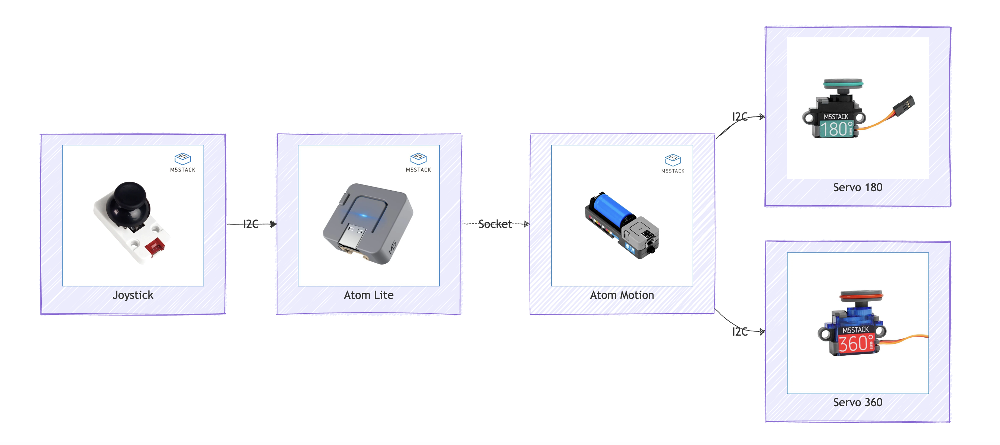

# Atom Motion


## Install ESP32 Micropython firmware

Download the firmware: https://micropython.org/download/esp32/ and
followed by

``` bash
# Install esptool
virtualenv venv
source venv/bin/activate
pip install esptool

# Erase device
esptool.py --port /dev/ttyUSB0 erase_flash

# Install firmware
esptool.py --chip esp32 --port /dev/ttyUSB0 --baud 750000 write_flash -z 0x1000 esp32-20210902-v1.17.bin
```

## Atom Motion controlled by Joystick

The communication between the joystick and the Atom Lite is established
via I2C, which transmits the information to the Atom Motion through a
socket connection. The Atom Motion controls two servos: one with a
180-degree range and another with a 360-degree range.

- [Joystick
  code](https://github.com/th1460/atom-motion/blob/main/joystick.py)

- ## [Atom Motion code](https://github.com/th1460/atom-motion/blob/main/atom_motion.py)

  \#`{mermaid} #flowchart LR #    A[Joystick] #    B[Atom Lite] #    C[Atom Motion] #    D[Servo 180] #    E[Servo 360] #    A --> |I2C| B #    B -.-> |Socket| C #    C --> |I2C| D #    C --> |I2C| E #`
  —



  

[](https://www.youtube.com/watch?v=GaSCiomFiuk)
