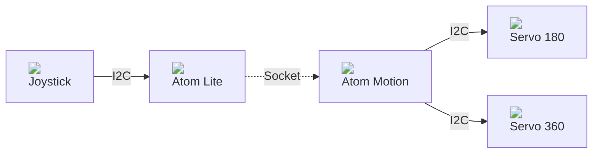

# Atom Motion

## Install ESP32 firmware

To download the firmware: https://micropython.org/download/esp32/

    # Install esptool
    pip install esptool

    # Erase device
    esptool.py --port /dev/ttyUSB0 erase_flash

    # Install firmware
    esptool.py --chip esp32 --port /dev/ttyUSB0 --baud 750000 write_flash -z 0x1000 esp32-20210902-v1.17.bin

## Atom Motion controled by Joystick

